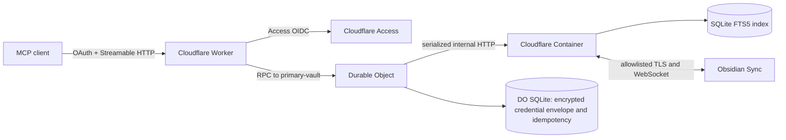

# Obsidian Sync MCP on Cloudflare

A single-vault, remote MCP server backed by official Obsidian Sync. A Cloudflare Worker handles MCP and OAuth, one named Durable Object serializes vault activity and records idempotency state, and a Cloudflare Container runs the official `obsidian-headless` client plus a local SQLite FTS5 index.

This is an implementation for one private vault, not a multi-tenant service. It is intentionally deny-by-default around paths, outbound network access, OAuth scopes, and destructive writes.

## What it provides

- Streamable HTTP MCP v2 at `/mcp`, with OAuth discovery, dynamic client registration, PKCE, consent, and `vault.read` / `vault.write` scopes.
- Cloudflare Access as the upstream identity provider for both MCP authorization and the bootstrap admin UI.
- Ranked full-text search over note bodies, titles, headings, scalar frontmatter, and tags, with pagination and filters.
- Revision-guarded note patches, attachment writes, moves, and deletes; UUID request IDs make MCP mutation retries idempotent.
- A pull-before-write and push-after-write pipeline using official Obsidian Headless, with explicit `sync_pending` results when remote confirmation fails.
- Protected `.obsidian` configuration, traversal/symlink/case-collision defenses, bounded request bodies, and a 5 MiB MCP attachment limit.

## Architecture



The vault and search index live on the Container's ephemeral disk. The encrypted Obsidian token, chosen vault, optional E2E password, and mutation receipts live in Durable Object SQLite. If the Container is replaced, `onStart()` reconstructs the local vault from Obsidian Sync before serving vault operations. The current configuration keeps the single Container warm so continuous Sync remains connected; see [architecture and Durable Object decision](docs/architecture.md) for the tradeoff.

## MCP tools

| Tool             | Scope | Behavior                                                              |
| ---------------- | ----- | --------------------------------------------------------------------- |
| `vault_status`   | read  | Readiness, sync state, queue depth, file counts, and Headless version |
| `list_files`     | read  | Filtered cursor-paginated note and attachment metadata                |
| `read_note`      | read  | Exact Markdown, metadata, line slicing, and SHA-256 revision          |
| `search_notes`   | read  | Ranked lexical search with prefix, tag, and property filters          |
| `get_links`      | read  | Wikilink outgoing links, backlinks, and unresolved links              |
| `get_attachment` | read  | Base64 embedded MCP resource up to 5 MiB                              |
| `create_note`    | write | Create-only atomic Markdown write                                     |
| `patch_note`     | write | Ordered exact patches guarded by a revision                           |
| `put_attachment` | write | Create or revision-guarded replace up to 5 MiB                        |
| `move_file`      | write | No-overwrite move with affected backlinks reported                    |
| `delete_file`    | write | Revision-guarded hard delete                                          |

Every mutation requires a fresh UUID `request_id`. Results that may include a local change are recorded: reusing their UUID with identical input returns the recorded result, while reusing it with different input fails. A failure that provably happened before any local change is not retained, so the same request can be retried after the underlying condition recovers.

## Deploy

Read [deployment](docs/deployment.md) before deploying. In short:

1. Create a Cloudflare Access generic OIDC SaaS application with callback URLs `https://YOUR_WORKER/callback` and `https://YOUR_WORKER/admin/callback`, then restrict it with an Access Allow policy.
2. Store the five Access values and three independent random application keys as Wrangler secrets.
3. Set `MCP_ALLOWED_HOSTNAMES` to the production Worker hostname in `wrangler.jsonc`.
4. Run `npm run check`, then `npm run deploy` from an environment with a Docker-compatible CLI and daemon.
5. Open `/admin`, sign in through Access, authenticate to Obsidian, and select the one remote vault.

The Worker creates the `OAUTH_KV` namespace during deployment. A Workers Paid plan, Cloudflare Containers access, Cloudflare Access, and an active Obsidian Sync subscription are required.

## Development

Node.js 22 or newer is required. Install locked dependencies with `npm ci`, then use:

```text
npm run typecheck
npm test
npm run build
npm run deploy:dry-run:worker
npm run deploy:dry-run
```

The last command also builds the Container image and therefore requires Docker or a Wrangler-compatible alternative. The Worker-only dry-run still validates bundling, bindings, Durable Object migrations, and the Container declaration.

Operational limitations and recovery procedures are documented in [security and operations](docs/security-operations.md). The headless-client investigation and rationale for the selected integration are in [headless access options](docs/headless-access.md).
